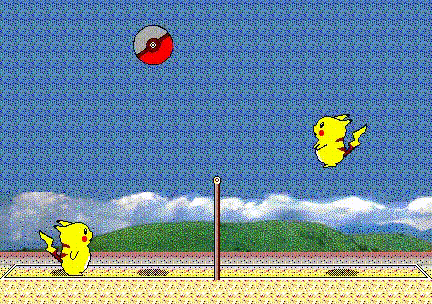

# Pikachu-Volleyball-RL

In this project, the primary goal is to train an AI agent capable of playing the classic game [Pikachu Volleyball](https://github.com/gorisanson/pikachu-volleyball). To achieve this, a combination of Reinforcement Learning (RL) techniques, Evolution Strategy (ES), and Selfplay mechanisms are employed. The project aims to create an AI agent that can outperform rule-based policies and exhibit robust gameplay across various scenarios.

## Requirements
- Python 3
- [Stable Baselines3](https://github.com/DLR-RM/stable-baselines3)
- [Gymnasium](https://github.com/Farama-Foundation/Gymnasium)
- [pytorch](https://github.com/pytorch/pytorch)

## Installment
1. Clone the project recursively
    
    `git clone --recurse-submodules {project_url}`
    
2. Install gym-pikachu-volleyball

    `pip install ./gym-pikachu-volleyball`

3. Install requirement packages

    `pip install -r requirements`

## Training

After install necessary packages, you can run `python train_[algorithm].py` in script folder to train the agent by yourself.

Currently there are 4 algorithms in training script
- `train_ppo.py`: train agent using ppo model
- `train_es.py`: train agent using evolution strategy
- `train_ppo_selfplay.py`: train agent using ppo ppo with selfplay
- `train_es_selfplay.py`: train agent using evolution strategy with selfplay

## Evaluation

To evaluate the model you haved trained, update the file name in corresponding eval file to your model path, and then run one of below script

- `eval_ppo.py`: evaluate ppo performance
- `eval_es.py`: evaluate evolution strategy performance

For evaluating two agents against each other, use the `--second_model` argument. To visualize agent actions, set `--eval` to false in order to render the environment.

You can also try the model that have been trained in `model` folder.

## Result

See the detail training process and result on [`TRAINING.md`](TRAINING.md)

## Acknowledge
This project is inspired by [slimevolleygym](https://github.com/hardmaru/slimevolleygym/tree/master), where various algorithms were employed to train an agent in playing Slime Volleyball.
## License
This project is licensed under the [MIT License](LICENSE).