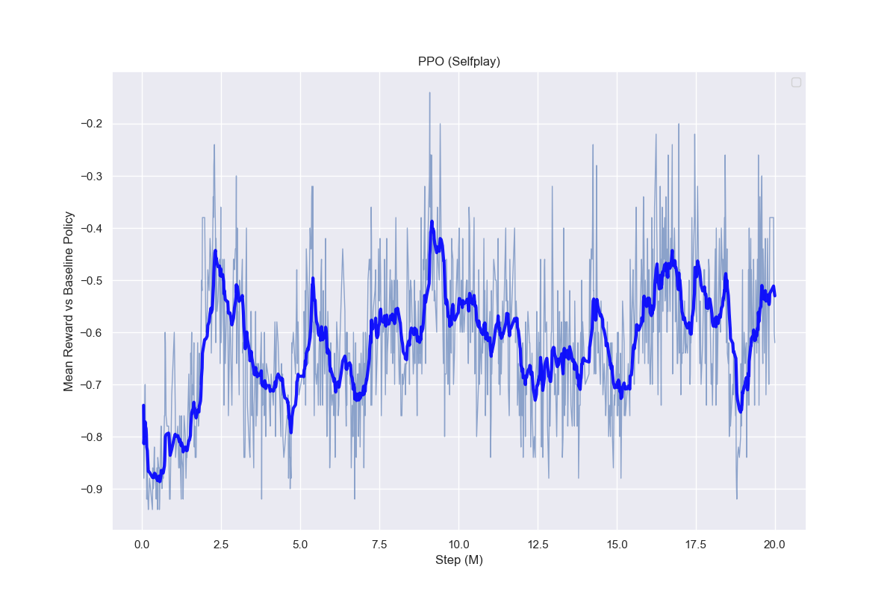

# Training in Pikachu-Volleyball

Here, I'm trying to solve the game with 2 different methods: 
* Traditional Proximal Policy Optimization (PPO) with baseline opponent
* Selfplay learning to improve the agent without baseline opponent.

## Environment

In the original version of the game, the behavior of the Pikachu agent follows a relatively predictable pattern due to the limited number of random states it encounters during gameplay. The deterministic nature of the environment contributes to the agent's ability to swiftly identify an optimal strategy within a mere 1 million steps of training.

To introduce an element of unpredictability and enhance the learning experience, I have introduced modifications to the environment. Specifically, I've incorporated variations by introducing random initial ball positions and velocities, thereby creating a more dynamic and challenging setting. For a comprehensive understanding of these alterations, you can delve into the `PikachuVolleyballRandomEnv` module. You can also see the detail of environment in [Pikachu-Volleyball](https://github.com/hankluo6/gym-pikachu-volleyball/tree/main)

### Proximal Policy Optimization (PPO)

Now, we employed stable-baselines3's PPO algorithm to train an adept pikachu-volleyball player. This agent is pitted against a rule-based policy for training purposes.  Our training process employs a single-thread PPO trainer for a span of 20 million steps (see [code]()).

In the original version of the game, where randomness was minimal, the agent's victories came relatively easily. By introducing controlled randomness, the agent continues to outperform the rule-based opponent. The most exceptional model exhibits a mean reward of 0.68, signifying an impressive winning percentage of 80%.

I also tested with different hyperparameters and found that adding an entropy coefficient can make the agent perform much better. However, we noticed a situation where the agent sometimes loses due to uncommon ball paths.  This occurs because these scenarios are rare during training, so the agent doesn't learn to handle them well. While trying to increase the entropy coefficient, we found that the agent starts exploring too randomly, which actually hurts its performance. There might be some methods to tackle this. First, we can consider using Exploration by Random Network Distillation (RND) to make the agent curious and explore more effectively. Another idea was to add curiosity to the agent's learning process, encouraging it to learn new behaviors that could help it handle these unexpected situations better.

### Evolution Strategy

In this section, we explore training the model using [OpenAI's Distributed Evolution Strategy](https://openai.com/research/evolution-strategies). In Natural Evolution Strategy, we introduce random noise vectors, denoted as $\epsilon$, as perturbations to each candidate solution. By adding Gaussian noise $\epsilon$ to the original parameters $\theta$ and assessing performance, we identify the updating direction based on candidate performance. 

Additionally, we implement rank-based fitness shaping and mirror sampling to enhance stability and effectiveness in the training process.

While its performance might not be as strong as other reinforcement learning methods, it's worth highlighting that this approach benefits from shorter training times compared to traditional reinforcement learning methods, thanks to its utilization of multiple CPUs.

## Selfplay Methods

The concept is simple yet effective: the agent learns by playing against itself. This method works particularly well for our scenario due to the game's zero-sum nature, where one player's gain is another's loss. Through self-play, we aim to uncover unique strategies that can outsmart the original baseline policy.

### Selfplay via PPO

In selfplay, there are more considerations we need to care when train the agent. The major consideration is the tradeoff between the agent skill level and the generality of the agent. If we train the agent against a set of quickly changing adversaries with high diversity, it might not learn much. On the other hand, if it only plays against one opponent for too long, it might become too specialized and struggle against others. It's about finding the right middle ground for the agent's training.

In our implementation, every time we reach a certain number of steps `SAVE_STEPS`, we save the current model into the history. Similarly, when we reach step count `SWAP_STEPS`, we choose a model from the saved history to be the new opponent. This way, we help the agent become more versatile by training it against different versions of itself that have performed well in the past.

Given the evolving opponents, the average reward from the environment doesn't tell us much. To address this, we've adopted the [ELO rating system](https://en.wikipedia.org/wiki/Elo_rating_system). By tracking changes in ELO ratings, we can gauge our agent's progress more effectively.

During training, we also evaluate our agent against a rule-based policy to gauge its performance against unseen opponents.

Despite the agent's average reward not reaching as high as when directly trained against the rule-based policy, it's noteworthy that even without prior experience against the rule-based policy, the best model still achieves a mean reward of 0.14 when tested against it.

### Selfplay via ES

The self-play result is not as favorable as observed with the PPO approach, but we don't have much time to do more experiment. Maybe the adversarial nature could make the learning process more intricate, demanding a balanced exploration-exploitation strategy. ES might struggle with achieving this balance, impacting its performance in these scenarios.

To address the challenges and potentially enhance the self-play results using ES, we can consider strategies such as hyperparameter tuning, extending the training duration, and experimenting with different reward shaping techniques. 

## Summary

We evaluation our model to against rule-based policy in 10000 episode

|Method|Average Score
|---|---|
|Maximum Possible Score|1.0
|PPO | 0.71 ± 0.70
|PPO (Self-Play) | 0.14 ± 0.99
|ES | 0.34 ± 0.94
|ES (Self-Play) | -0.38 ± 0.84
|Random Policy | -0.87 ± 0.50

We also compare the agents with each other

|Method|PPO|PPO (Selfplay)|ES |ES (Selfplay)
|---|---|---|---|---
|PPO | — |  0.16 ± 0.99 | 0.07 ± 1.00 | 0.71 ± 0.71 | 
|PPO (Selfplay) | 0.05 ± 1.00 | — | -0.18 ± 0.98 | 0.66 ± 0.75 | 
|ES  | 0.08 ± 1.00 | 0.19 ± 0.98 | — | 0.43 ± 0.90 |
|ES (Selfplay) | -0.32 ± 0.95 | -0.12 ± 0.99 | 0.10 ± 1.00 | — |